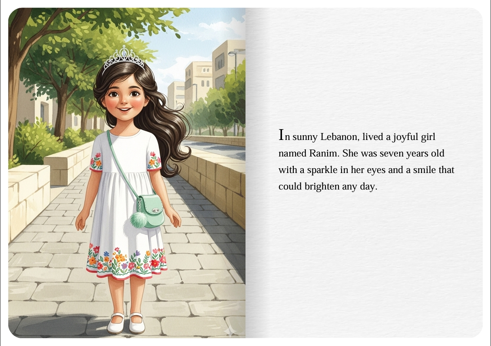

# Gemini Storybook PDF Chrome Extension

A reverse-engineered Chrome extension based on the original Gemini Storybook Exporter, enhanced with additional features for better typography and visual presentation.



## 🌟 Features

### Core Functionality
- **Export Images and Texts**: Download all images and text content from Gemini Storybook as a ZIP file
- **PDF Export**: Generate beautifully formatted PDF documents from story content
- **Multi-language Support**: Available in English, Spanish, French, Japanese, Korean, Chinese (Simplified), and Chinese (Traditional)

### ✨ Enhanced Features (Added)
- **📝 Word Wrapping**: Prevents last word from being split across two lines for better readability and professional appearance
- **📄 Paper Texture**: Realistic paper texture background for authentic book-like appearance
- **🎨 Drop Cap Styling**: Elegant drop caps for the first letter of paragraphs, enhancing readability
- **🔤 Better Fonts**: Custom font integration with fallback to premium serif fonts (Times New Roman, Georgia, Garamond, Book Antiqua, Palatino)
- **📚 Book Page Shadow**: Subtle shadow effects to create depth and book-like page appearance
- **🔲 Rounded Edges**: Smooth rounded corners on page elements for modern, polished appearance
- **📏 Print Margins**: Optimized page margins (1 inch on all sides) ensuring proper print layout and professional document formatting

## 🚀 Installation

### From Source
1. Clone or download this repository
2. Open Chrome and navigate to `chrome://extensions/`
3. Enable "Developer mode" in the top right
4. Click "Load unpacked" and select the project folder
5. The extension will be installed and ready to use

### Prerequisites
- Google Chrome browser
- Access to [Gemini Storybook](https://gemini.google.com/overview/storybook/)

## 📖 Usage

1. **Navigate to Gemini Storybook**: Visit [https://gemini.google.com/overview/storybook/](https://gemini.google.com/overview/storybook/)
2. **View a Story**: Open any story in the Gemini Storybook interface
3. **Export Options**: You'll see two export buttons:
   - **"Download Images and Texts"**: Exports all images and text as a ZIP file
   - **"Export PDF"**: Creates a formatted PDF with enhanced typography

### Settings
- Right-click the extension icon and select "Options" to configure:
  - Toggle export button visibility
  - Set custom file name prefix
  - Access Gemini Storybook website

## 🎨 Typography Enhancements

### Font System
- **Primary Font**: Custom Gemini font with fallback to premium serif fonts
- **Font Stack**: `'GeminiFont', 'GeminiFontAlt', 'Times New Roman', 'Georgia', 'Garamond', 'Book Antiqua', 'Palatino', serif`
- **Optimized Rendering**: Enhanced text rendering with antialiasing and subpixel rendering

### Drop Cap Styling
- **Size**: 4.2em for dramatic effect
- **Weight**: Bold (700) for emphasis
- **Positioning**: Floating left with proper spacing
- **Shadow**: Subtle text shadow for depth

### Visual Enhancements
- **Paper Texture**: Realistic background texture for authentic book feel
- **Page Shadows**: Subtle shadow effects for depth
- **Rounded Edges**: Smooth rounded corners on page elements for modern, polished appearance
- **Print Margins**: Optimized page margins (1 inch on all sides) ensuring proper print layout and professional document formatting
- **Word Wrapping**: Prevents last word from being split across two lines for better readability and professional appearance
- **Line Height**: Optimized at 1.7 for comfortable reading
- **Letter Spacing**: Fine-tuned at 0.02em for better readability

## 🛠️ Technical Details

### Architecture
- **Manifest Version**: 3 (Chrome Extension Manifest V3)
- **Content Scripts**: Injected into Gemini Storybook pages
- **Background Service Worker**: Handles download operations
- **Storage**: Chrome sync storage for user preferences

### File Structure
```
├── manifest.json              # Extension configuration
├── popup.html                 # Extension popup interface
├── options.html               # Settings page
├── js/
│   ├── background.js          # Service worker for downloads
│   ├── content_script.js      # Main content injection
│   ├── font-loader.js         # Font loading and application
│   ├── popup.js              # Popup interface logic
│   ├── options.js            # Settings page logic
│   └── vendor.js             # Dependencies
├── css/
│   └── font-styles.css       # Typography and styling
├── _locales/                 # Internationalization files
├── font.ttf                  # Custom font file
├── page_texture.jpg          # Paper texture background
└── icon.png                  # Extension icon
```

### Key Technologies
- **Chrome Extension APIs**: Storage, Downloads, Runtime
- **CSS3**: Advanced typography, drop caps, shadows
- **JavaScript ES6+**: Modern async/await patterns
- **Web Fonts**: Custom font loading and fallback system

## 🔧 Development

### Building from Source
1. Clone the repository
2. No build process required - the extension uses vanilla JavaScript and CSS
3. Load as unpacked extension in Chrome

### Customization
- **Fonts**: Replace `font.ttf` with your preferred font
- **Styling**: Modify `css/font-styles.css` for different visual effects
- **Textures**: Replace `page_texture.jpg` with custom paper textures

## 📝 License

This project is a reverse-engineered enhancement of the original Gemini Storybook Exporter. Please respect Google's terms of service when using this extension.

## 🤝 Contributing

Contributions are welcome! Please feel free to submit issues, feature requests, or pull requests.

## ⚠️ Disclaimer

This extension is not officially affiliated with Google or Gemini. It's a community-driven enhancement of the original functionality. Use at your own discretion and in accordance with Google's terms of service.

## 🔗 Links

- [Gemini Storybook](https://gemini.google.com/overview/storybook/)
- [Chrome Extensions Documentation](https://developer.chrome.com/docs/extensions/)

---

**Note**: This extension enhances the original Gemini Storybook Exporter with improved typography, visual effects, and user experience while maintaining compatibility with the original functionality.
